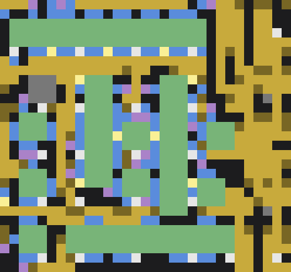

# fbp — Factorio blueprint tools

Read, analyse and edit **Factorio 2.0 / Space Age** blueprint strings outside the
game. `fbp` decodes a string, works out **what can be on every belt lane**, tells
you **which machines are missing an ingredient**, and applies edits as a checked
patch. A VS Code extension draws the whole thing on a pan-and-zoom canvas and
lets you edit it by hand.

Built for real base exports: the analysis runs over a 5,600-entity base in about
0.2 seconds.



<sub>The bundled test fixture drawn by <code>fbp render --png</code>. Machines green, furnaces orange, belts by tier, inserters blue.</sub>

## Why

A blueprint string is 500 KB of compressed JSON. Once a base is large enough to
be interesting, questions like *"what is actually on this belt?"*, *"why is this
assembler idle?"* and *"will moving this break anything downstream?"* are hard to
answer by eye, and harder to answer after a game update changes a recipe.

`fbp` answers them from the string itself.

## Install

Needs Python 3.10 or newer. No required dependencies.

```bash
git clone https://github.com/chrisjmendoza/factorio-blueprint-tools
cd factorio-blueprint-tools
pip install -e ".[dev]"      # gives you the `fbp` command, plus pytest and Pillow
```

Or run it in place with `python -m fbp ...`.

## Quick start

```bash
fbp info base.txt --recipes          # what is in this blueprint
fbp check base.txt                   # machines with an ingredient nothing supplies
fbp flow base.txt --at 103 77        # what can be on the belt at this tile
fbp render base.txt 104 73 122 84    # ASCII map of a region
fbp trace base.txt --recipe substation
```

## Commands

```
fbp info FILE [--counts] [--recipes]         summary, entity counts, recipe counts
fbp decode FILE [-o out.json]                blueprint string -> JSON
fbp encode FILE.json [-o out.txt]            JSON -> blueprint string
fbp render FILE [x0 y0 x1 y1] [--entities]   ASCII map of a region (whole print if no box)
fbp render FILE --png out.png [--scale N]    tile-coloured PNG of the whole print
fbp find FILE --recipe R | --name N          list matching entities with ids and positions
fbp trace FILE --recipe R | --id N ...       inputs, outputs and belt lines of a machine
fbp trace FILE --at X Y                      a belt tile: what flows in, and every consumer downstream
fbp flow FILE [--feeds F] [--at X Y] [--json OUT]   what can be on each belt lane; machine ok/missing/unknown
fbp check FILE [--recipe R]                  crafters missing an ingredient source; lane-mix warnings
fbp lint FILE [--only CODE ...] [--strict]   belts and inserters that point at nothing useful
fbp diff A B                                 what changed between two versions (machines, check, lint, lanes)
fbp patch FILE patch.json -o out.txt         remove / re-recipe / add entities, write a new string
fbp crop FILE x0 y0 x1 y1 -o out.txt         cut a region out as its own blueprint
fbp gamedata [--dump PATH]                   rebuild recipe data from the game's own dump
fbp recipe NAME ...                          show recipes from the loaded data
```

`FILE` may be a blueprint string (a `.txt` as exported from the game) or a
decoded `.json`. Books are read; commands operate on the first blueprint.

## What is on the belts

`fbp flow` works out what can be on the **left and right lane of every belt**, by
propagating from producers to a fixed point:

- an inserter drops on the **far** lane, and long-handed inserters reach two tiles
- a curve keeps both lanes; a belt entering another belt's **side** sideloads onto
  the near lane
- a belt sideloading into an underground tile passes only the lane aligned with
  the open half, entrance or exit — the one-lane filter trick
- filter splitters route; other splitters keep lanes and feed both outputs
- assemblers emit their recipe's products, furnaces emit the smelting result of
  whatever reaches them, chests relay what is dropped in

Each machine then gets a status: **ok** when every item ingredient reaches it,
**missing** when something does not, **unknown** when the only candidate supplier
is a furnace whose input has not been declared.

### Edge feeds

A blueprint rarely contains its own ore. Declare what enters from outside in
`<name>.feeds.json` beside the string:

```json
[{"x": 30, "y": 81, "items": ["iron-ore"], "lane": "both"},
 {"x": 30, "y": 91, "items": ["copper-ore"], "lane": "right"}]
```

Declare ore at the head of each furnace column and plates resolve all the way
down the bus. In the viewer, **feed** mode does this by clicking a belt.

This is a *could be here* analysis, not a simulation. Items are never consumed,
so a lane showing two items has both arriving on it somewhere upstream. It
proves an item is available, not that it arrives fast enough — **throughput is
not modelled**.

## Verifying an edit

After any patch, run `fbp diff BEFORE AFTER`. It matches machines by position and
lists every one whose recipe, inputs or outputs changed with an ingredient
status, then shows which check problems, lint findings and lane-mix warnings
appeared or disappeared. Only the machines you meant to touch should be listed,
and nothing should be `NEW:`.

`fbp trace FILE --at X Y` answers "if I drop an item on this tile, where does it
go?" — the upstream line and every consumer downstream, through undergrounds and
splitters. Worth running before any sideload.

**Lane mix.** A mall belt is meant to carry one item per lane. `check` warns when
inserters put two different items on the same lane. Plenty of working bases do
this deliberately, so treat it as a before/after comparison, not an absolute.

**Lint codes:** `belt-dead-end`, `belt-into-entity`, `underground-unpaired`,
`splitter-no-input`, `splitter-no-output`, `inserter-from-empty`,
`inserter-to-ground`, `inserter-from-useless`, `inserter-to-useless`.
Undergrounds at the edge of an export whose partner was outside the selection
show up as unpaired; that is information, not an error.

## The viewer

`vscode/` is a dependency-free VS Code extension that renders a blueprint on a
canvas: pan, zoom, hover for detail, search to highlight, and paint every belt
lane with what the flow says is on it.

- **A map that reads like the game** — zoomed in past 8 px a tile, belts become a
  dark track under two bright chevrons a tile, so a run of belt reads as one
  moving line, and machines get a lit top edge and a shaded bottom one so the
  icon sits on a body rather than a flat patch. Zoomed out, belts go back to
  solid tier colours, which is how you read the shape of a base at a glance.
- **Belts by tier** — yellow, red, blue, green for turbo, undergrounds darker and
  splitters lighter. Each underground draws a dashed line to its partner down
  the middle of the tiles, in the tier's light colour over a dark casing so it
  reads even when it runs over a belt of its own colour. The line goes faint
  only where it crosses a machine, chest or pole, leaving the icon and text
  underneath legible; hovering either end draws the whole run solid and shades
  the reach. Unpaired ends are outlined red.
- **Inserters by type**, drawn as an arrow pointing the way the item travels.
  Hovering one marks both ends: blue on the tile it picks from, green on the
  tile it drops onto, with the whole chest or machine standing there outlined.
  A drop onto a belt is marked on the lane the items actually land on — the far
  one — so a pair of inserters filling both lanes is obvious at a glance.
  A long-handed inserter shows the tile it reaches over as a dashed outline.
- **Splitters show their sorting** — a bar across the priority output edge, in
  the colour of the filtered item with that item's icon on the cell it leaves
  by, and a dimmer bar on a preferred input. The side panel spells it out, and
  says so when a filter has no output priority and therefore does nothing.
- **Machines outlined** green, red or dashed grey by flow status, with a label
  saying what a red one is missing, and a clickable list in the side panel.
- **Edit mode** — remove, rotate, flip an underground, change a recipe from a
  searchable list, or place from a palette with shift-drag to paint a run. The
  page never mutates the blueprint: edits accumulate as a patch in the `fbp
  patch` format, with per-edit revert. **export…** applies it with `fbp patch`
  into a new file, then runs `fbp diff` and `fbp check` over the result.

The flow, the editing and the rendering all run **in the page**
(`vscode/media/flow.js` is a port of `fbp/flow.py`, with a test asserting the two
agree). So `vscode/media/viewer.html` works opened directly in a browser too, by
dropping a `.txt` on it or pasting a string. Only **export** needs the extension,
because only it can run Python and write files.

### Real Factorio icons

The viewer can draw the game's own item and machine icons instead of coloured
tiles. **Factorio's artwork belongs to Wube Software and is not redistributable**,
so none of it is in this repository. Build the atlas from the copy of the game
you already own:

```bash
fbp icons                      # finds a Steam install, or pass --factorio DIR
```

That reads the icons named in the prototype dump and writes
`vscode/media/icons.png` and `icons.js`, both git-ignored. It takes every
item-like prototype — science packs, ammo, modules, capsules, armour, guns and
equipment as well as plain items — plus fluids and the buildings the viewer
draws, so a modded install contributes its icons too. Reload the viewer and
machines show the icon of what they make, every other building shows its own
(radar, roboport, tank, turret), chests, poles and lamps show theirs once you
zoom past 12 px a tile, belt lanes show the items on them, and the legend, the
missing-inputs list and the recipe picker all use icons. The **icons** toggle
turns them off; without the atlas the viewer falls back to coloured tiles and
the toggle is disabled.

Icons that live inside mod `.zip` archives are skipped with a note.

On the hosted page there is no atlas to find, so the **icons…** button takes the
`icons.png` and `icons.js` that `fbp icons` wrote on your machine and keeps them
in the browser (IndexedDB) for next time. Nothing is uploaded — the image stays
a blob URL inside the page — and nothing about the game's art is served by the
site itself.

### The viewer as a web page

The page needs no extension host: it decodes a blueprint string, computes the
flow and edits in the browser, and remembers feeds in `localStorage`. Only
**export** is VS Code only, because that shells out to `fbp patch` and
`fbp diff`.

```
bash scripts/build-web.sh            # writes public/
python -m http.server -d public      # then open http://localhost:8000
```

`vercel.json` points Vercel at that script, so a push to `main` deploys it: no
install step, no framework, `public/` as the output. A deployed build carries
`sample.txt` (the mall fixture) behind a **load an example blueprint** button so
a first visit has something to look at, and it deliberately does **not** carry
the icon atlas — that art is Wube's. The build writes a stub instead and the
page falls back to coloured tiles. `FBP_WEB_ICONS=1` includes the atlas for a
local build you are not publishing.

### Installing the extension

No build step. Link the folder into your extensions directory and reload:

```bat
mklink /J "%USERPROFILE%\.vscode\extensions\fbp-viewer" "<path to this repo>\vscode"
```

```bash
ln -s "$PWD/vscode" ~/.vscode/extensions/fbp-viewer
```

Then open a blueprint `.txt` and run **fbp: Open blueprint viewer**. Settings:
`fbp.python` (interpreter) and `fbp.toolsPath` (folder holding the `fbp`
package, defaults to this repo).

## Game data

Recipes and footprints come from the game itself, so the tool is right about
*your* install including mods. With Factorio closed:

```bat
factorio.exe --dump-data
fbp gamedata
```

The first writes `%APPDATA%\Factorio\script-output\data-raw-dump.json` (~28 MB);
`fbp gamedata` boils it down to `data/gamedata.json` (~130 KB, committed) and
`vscode/media/gamedata.js` for the viewer. Re-run both after a game update or a
mod change that touches recipes. Set `FBP_DATA_DUMP` if your dump lives
elsewhere. Without either file a small built-in table covers common mall recipes
and everything else is reported as unknown rather than guessed.

The committed data is from **Factorio 2.0.77 with Space Age**, dumped from an
install that had mods enabled, so it carries two extra recipes from LTN
Combinator Modernized. Regenerate it from your own install for exact results.

## Patch format

```json
{
  "remove": [1057, 885],
  "recipe": {"883": "copper-cable"},
  "add": [
    {"name": "inserter", "position": {"x": 113.5, "y": 75.5}, "direction": 0},
    {"name": "transport-belt", "position": {"x": 111.5, "y": 77.5}, "direction": 8}
  ]
}
```

Ids refer to the input file (get them from `find`, `trace` or the viewer). New
entities may not overlap existing ones. Removing an entity that has circuit or
copper wires is refused unless `"drop_wires": true`. The output is renumbered and
wires are remapped.

## Geometry notes

Positions are entity **centres**: a 3x3 machine at (114.5, 77.5) covers x 113–115,
y 76–78. An inserter's stored `direction` points at its **pickup** tile and it
drops on the opposite side; the viewer's palette flips this so the direction you
choose is the direction items move. Underground pairs match on tier, axis and
opposite type within reach (5/7/9/11 tiles).

`docs/belt-patterns.md` is a sourced reference on lane mechanics, sideloading,
the underground filter, splitter behaviour and column layouts.

## Limitations

- **No throughput.** Availability is proven; rates are not.
- **Fluids are not traced.** Pipe networks are not modelled yet, so machines with
  fluid ingredients are not judged on that side.
- **Rails and rolling stock** are indexed at a single tile, so train layouts can
  miss collisions.
- Quality, modules and circuit conditions are preserved through edits but do not
  affect the analysis.

## Layout

```
fbp/            codec, model, gamedata, render, trace, flow, check, lint, patch, diff, cli
vscode/         extension.js (host) + media/ (viewer.html/css/js, flow.js, gamedata.js)
data/           gamedata.json, generated from the game's dump
docs/           belt-patterns.md
tests/          pytest; fixtures/mall.txt is a crop of a real mall
```

## Tests

```bash
pytest
```

Covers the codec round trip, footprint and inserter geometry, underground
pairing, the supply check, lane flow including the sideload and underground
cases, patching and cropping, viewer asset wiring, and parity between the Python
and JavaScript flow implementations (needs `node`; skipped if absent).

## License

MIT. See [LICENSE](LICENSE).

Factorio is a trademark of Wube Software. This project is not affiliated with
Wube Software.
